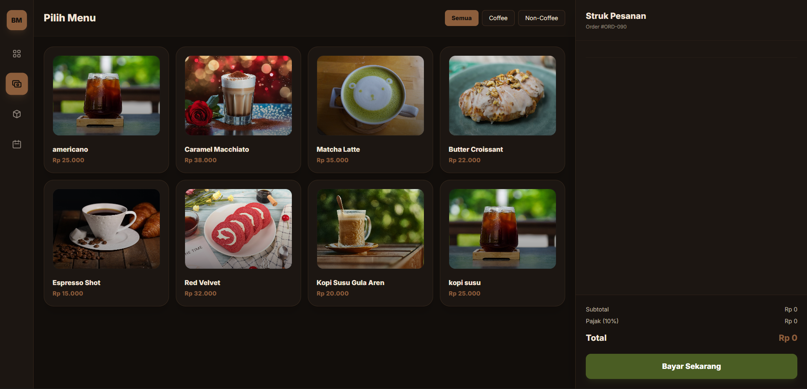
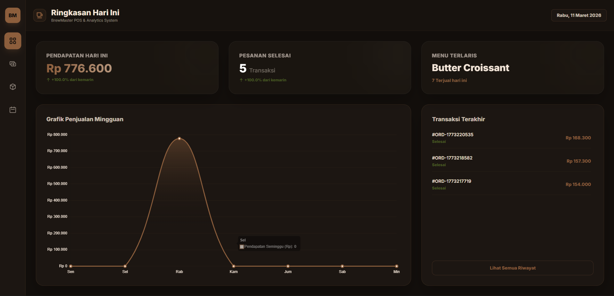

# ☕ Brewmaster POS (Kopi Bosku)

A lightweight, full-stack Point of Sale (POS) and Management Dashboard built specifically for coffee shops. This project demonstrates strong fundamentals in building a complete system from scratch using Vanilla JavaScript, HTML, and a powerful Golang backend.

## 📖 Overview
Brewmaster POS is designed to handle daily coffee shop operations without the overhead of heavy frontend frameworks. It features a fast and responsive Cashier interface, Real-time Dashboard Analytics, Inventory Management, and Employee Scheduling. The backend is powered by Golang and SQLite, ensuring high performance and easy deployment.

## 📸 Sneak Peek


*Intuitive Point of Sale interface for quick order processing and cart management.*


*Comprehensive admin dashboard with Chart.js integration for revenue and sales tracking.*

## 🚀 Tech Stack
* **Frontend:** HTML5, Vanilla JavaScript, Tailwind CSS (CDN)
* **Data Visualization:** Chart.js
* **Backend:** Golang (Gin Framework)
* **Database:** SQLite (`modernc.org/sqlite`)
* **Payment Gateway Mockup:** Midtrans (Integrated at Backend)

## ✨ Key Features
* **Cashier System:** Dynamic cart management, tax calculation, and real-time checkout process communicating directly with the Golang API.
* **Analytics Dashboard:** Visual representation of total revenue, orders, and best-selling items using Chart.js.
* **Inventory Management (Stok):** CRUD operations for the coffee shop's menu and stock items.
* **Shift Scheduling:** Real-time clock and local storage implementation for managing barista shifts and daily agendas.
* **Pure DOM Manipulation:** Built entirely without frontend frameworks, highlighting deep understanding of DOM APIs and asynchronous JavaScript (`fetch`).

## 💻 How to Run Locally

### 1. Start the Backend (Golang)
Ensure you have Go installed on your machine.
```bash
# Clone the repository
git clone [https://github.com/yourusername/brewmaster-pos.git](https://github.com/yourusername/brewmaster-pos.git)
cd brewmaster-pos

# Run the Golang server (runs on http://localhost:8080)
go run main.go
